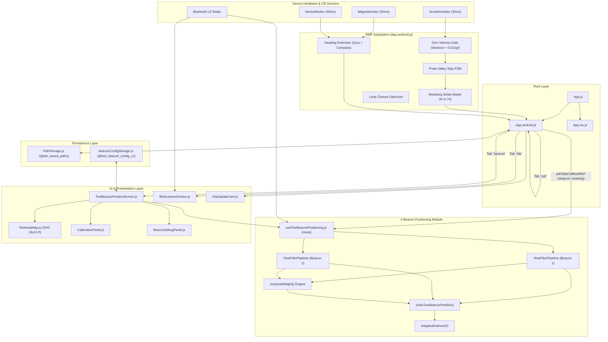

# 01. Architecture, File Connections & UI Wireframes

This document provides a complete breakdown of the **Indoor Navigation & PDR (Pedestrian Dead Reckoning)** codebase. It outlines what each file does, the connections and data-flows between components and services, and visual wireframes of the entire application.

---

## 1. Project Directory Structure

```text
PDR_ExpoGo/
├── App.js                                # Cross-platform entry router (iOS vs Android)
├── App.android.js                        # Android main screen (Tabs: PDR, BLE Scan, 2-Beacon)
├── App.ios.js                            # iOS main screen (Tabs: PDR, BLE Scan)
├── PathStorage.js                        # AsyncStorage & in-memory fallback for PDR routes
├── package.json                          # Dependencies (Expo SDK 54, React Native 0.81, BLE-PLX, SVG)
├── app.json                              # Expo app configuration & native permissions
├── components/
│   ├── BleScannerSection.js              # BLE scanning tool, RSSI charts & single-beacon tracker
│   ├── TwoBeaconPositionScreen.js        # 4-stage 2-Beacon Indoor Positioning screen
│   ├── TestAreaMap.js                    # Interactive 18×15 ft SVG indoor room map
│   ├── CalibrationPanel.js               # RSSI @ 1m calibration modal/panel
│   ├── BeaconDebugPanel.js               # Real-time mathematical diagnostic panel
│   └── OtaUpdateCard.js                  # EAS Over-The-Air update checker
├── hooks/
│   └── useTwoBeaconPositioning.js        # Core positioning state-machine, BLE loop & Kalman filter
├── services/
│   ├── BleScannerService.js              # BLE hardware manager, One-Euro filter & distance models
│   ├── twoBeaconServices.js              # Trilateration solver, coordinate math, Adaptive Kalman 2D
│   └── beaconConfigStorage.js            # Configuration persistence for 2-Beacon system
└── knowledge base/                       # System documentation & technical specifications
    ├── 01_architecture_file_connections_and_wireframes.md
    ├── 02_core_logic_algorithms_and_math.md
    └── 03_codebase_critique_and_improvements.md
```

---

## 2. File Inventory: What Every File Does

### Application Entry & Routing

| File | Primary Responsibility | Key Exports / Functions |
| :--- | :--- | :--- |
| [`App.js`](file:///c:/Users/harsh.p/Desktop/Indoor%20Navigation/PDR_ExpoGo/App.js) | Root component selector. Inspects `Platform.OS` and mounts [`App.android.js`](file:///c:/Users/harsh.p/Desktop/Indoor%20Navigation/PDR_ExpoGo/App.android.js) or [`App.ios.js`](file:///c:/Users/harsh.p/Desktop/Indoor%20Navigation/PDR_ExpoGo/App.ios.js). | Default `App()` component |
| [`App.android.js`](file:///c:/Users/harsh.p/Desktop/Indoor%20Navigation/PDR_ExpoGo/App.android.js) | Android navigation hub. Implements raw sensor listeners (Accelerometer, Magnetometer, DeviceMotion, Pedometer), ZUPT step detector, Weinberg stride model, PDR map, path recording, and tab switching between **PDR**, **BLE Scan**, and **2-Beacon**. | Default `AppAndroid()` component |
| [`App.ios.js`](file:///c:/Users/harsh.p/Desktop/Indoor%20Navigation/PDR_ExpoGo/App.ios.js) | iOS navigation hub. Mirrors PDR and BLE features of Android, but currently omits the 2-Beacon tab. | Default `AppIOS()` component |

### Storage & Persistence Layer

| File | Primary Responsibility | Key Exports / Functions |
| :--- | :--- | :--- |
| [`PathStorage.js`](file:///c:/Users/harsh.p/Desktop/Indoor%20Navigation/PDR_ExpoGo/PathStorage.js) | Persists user-recorded PDR walking paths. Includes a memory fallback if native `AsyncStorage` fails or runs in a constrained environment. | `getSavedPaths()`, `savePath()`, `deleteSavedPath()`, `clearAllSavedPaths()` |
| [`services/beaconConfigStorage.js`](file:///c:/Users/harsh.p/Desktop/Indoor%20Navigation/PDR_ExpoGo/services/beaconConfigStorage.js) | Persists 2-Beacon setup data (selected beacon IDs, beacon names, room coordinates, calibrated TxPower, path-loss exponent $n$, and 3D height settings). | `DEFAULT_CONFIG`, `loadBeaconConfig()`, `saveBeaconConfig()`, `resetBeaconConfig()` |

### Business Logic, Math & Hardware Services

| File | Primary Responsibility | Key Exports / Functions |
| :--- | :--- | :--- |
| [`services/BleScannerService.js`](file:///c:/Users/harsh.p/Desktop/Indoor%20Navigation/PDR_ExpoGo/services/BleScannerService.js) | Manages native Bluetooth LE scanning via `react-native-ble-plx`. Implements low-pass and adaptive **One-Euro filtering**, per-device tracking state machine, log-distance path loss, kinematic slew-rate clamping, and Android runtime permission requests. | `getBleManager()`, `OneEuroFilter`, `DeviceDistanceTracker`, `calculateDistance()`, `requestBluetoothPermissions()`, `ensureBluetoothEnabled()` |
| [`services/twoBeaconServices.js`](file:///c:/Users/harsh.p/Desktop/Indoor%20Navigation/PDR_ExpoGo/services/twoBeaconServices.js) | Contains all mathematical formulations for 2D indoor positioning: coordinate conversions (feet ↔ screen pixels), multi-stage RSSI pipeline (`RssiFilterPipeline`), 3D slant-to-horizontal height correction, multi-metric reliability weighting engine, analytical 2-circle intersection solver, and the `AdaptiveKalman2D` filter. | `feetToScreen()`, `screenToFeet()`, `clampToRoom()`, `RssiFilterPipeline`, `rssiToDistance()`, `applyHeightCorrection()`, `computeWeight()`, `solveTwoBeaconPosition()`, `AdaptiveKalman2D` |
| [`hooks/useTwoBeaconPositioning.js`](file:///c:/Users/harsh.p/Desktop/Indoor%20Navigation/PDR_ExpoGo/hooks/useTwoBeaconPositioning.js) | Central React hook driving the 2-Beacon module. Controls BLE scan loops, 10 Hz calculation intervals, 20 FPS UI state refresh, PDR step ingestion (`pdrStepCallbackRef`), Kalman filtering, ground-truth error calculations, and lifecycle actions. | `useTwoBeaconPositioning()` hook returning state & action handlers |

### Presentation & UI Components

| File | Primary Responsibility | Key Exports / Functions |
| :--- | :--- | :--- |
| [`components/TwoBeaconPositionScreen.js`](file:///c:/Users/harsh.p/Desktop/Indoor%20Navigation/PDR_ExpoGo/components/TwoBeaconPositionScreen.js) | Primary UI container for 2-Beacon positioning. Manages a 4-stage wizard: **1. Select Beacons** → **2. Place Beacons** → **3. Calibrate** → **4. Position Test**. Host of settings, diagnostics, and test controls. | Default `TwoBeaconPositionScreen` |
| [`components/TestAreaMap.js`](file:///c:/Users/harsh.p/Desktop/Indoor%20Navigation/PDR_ExpoGo/components/TestAreaMap.js) | Interactive SVG indoor room rendering (18×15 ft). Supports dragging beacons via `PanResponder`, draws 3 ft grid lines, user cursor with orientation heading arrow, history trails, and ground-truth benchmark markers. | Default `TestAreaMap` |
| [`components/CalibrationPanel.js`](file:///c:/Users/harsh.p/Desktop/Indoor%20Navigation/PDR_ExpoGo/components/CalibrationPanel.js) | Calibration UI card for Stage 3. Samples beacon RSSI at 1 meter over 3 seconds, computes median $TxPower$, and allows manual adjustment of path-loss exponent $n$. | Default `CalibrationPanel` |
| [`components/BeaconDebugPanel.js`](file:///c:/Users/harsh.p/Desktop/Indoor%20Navigation/PDR_ExpoGo/components/BeaconDebugPanel.js) | Collapsible diagnostics dashboard. Displays raw RSSI, filtered RSSI, estimated distances, weights, confidence score, BLE vs PDR vs Fused coordinates, and ground truth error. | Default `BeaconDebugPanel` |
| [`components/BleScannerSection.js`](file:///c:/Users/harsh.p/Desktop/Indoor%20Navigation/PDR_ExpoGo/components/BleScannerSection.js) | Standalone BLE diagnostic scanner. Lists all surrounding BLE devices, RSSI bars, signal quality, and includes a live SVG distance time-series chart for a selected beacon. | Default `BleScannerSection` |
| [`components/OtaUpdateCard.js`](file:///c:/Users/harsh.p/Desktop/Indoor%20Navigation/PDR_ExpoGo/components/OtaUpdateCard.js) | UI card for EAS Over-The-Air updates. Checks for remote updates, downloads them, and reloads the app runtime without native re-compilation. | Default `OtaUpdateCard` |

---

## 3. High-Level System Architecture & Connection Diagram

The diagram below visualizes how sensor data, BLE packets, user gestures, and storage interact across all files.



---

## 4. Cross-Module Data Flow & Lifecycles

### A. PDR Step Detection to 2-Beacon Fusion Bridge
1. **Accelerometer Sampling**: [`App.android.js`](file:///c:/Users/harsh.p/Desktop/Indoor%20Navigation/PDR_ExpoGo/App.android.js) polls accelerometer at 30ms (~33 Hz).
2. **Filtering & ZUPT**: Removes static gravity, computes dynamic variance. If variance $< 0.012\text{ g}^2$, user is stationary.
3. **Peak-Valley Detection**: Upon a validated footstep, Weinberg model calculates dynamic step length ($0.50\text{m} - 1.05\text{m}$).
4. **Bridge Ref**: [`App.android.js`](file:///c:/Users/harsh.p/Desktop/Indoor%20Navigation/PDR_ExpoGo/App.android.js) executes `pdrStepCallbackRef.current({ stepLengthMeters, heading })`.
5. **Kalman Prediction**: [`hooks/useTwoBeaconPositioning.js`](file:///c:/Users/harsh.p/Desktop/Indoor%20Navigation/PDR_ExpoGo/hooks/useTwoBeaconPositioning.js) receives the callback, projects $\Delta x = d \cdot \sin(\theta)$ and $\Delta y = d \cdot \cos(\theta)$, updating `kalmanRef.current.predict(dx, dy)`.

### B. BLE Packet Processing to Trilateration Update
1. **Packet Arrival**: BLE scan listener captures advertisement packets containing RSSI.
2. **Pipeline Filtering**: Raw RSSI passes through `RssiFilterPipeline`:
   - Outlier rejection ($[-105, -15\text{ dBm}]$).
   - Rolling median (5-7 samples) removes channel hopping spikes.
   - One-Euro filter strips noise while preserving responsiveness.
   - Asymmetric EMA damps signal drops from human body shielding.
3. **Distance & 3D Correction**: Log-distance path loss calculates slant distance, then Pythagorean height correction projects horizontal ground distance.
4. **Weighted Solver**: Analytical 2-circle intersection calculates $(x, y)$ coordinates with candidate disambiguation.
5. **Kalman Measurement Update**: Filter corrects state position with dynamic covariance updates at 10 Hz.
6. **UI Refresh**: At 20 FPS (50ms interval), coordinates are rendered smoothly on `TestAreaMap.js`.

---

## 5. UI Layout Wireframes

### Wireframe 1: Top-Level Tab Switcher & PDR Tab (`App.android.js`)

```text
+-------------------------------------------------------------+
|                     Indoor PDR Navigation                   |
| Dynamic Weinberg Step • Compass & Gyro Heading • 2D Map     |
+-------------------------------------------------------------+
|  [ 🚶 PDR (Active) ]   [ 📶 BLE Scan ]   [ 🛰️ 2-Beacon ]     |
+-------------------------------------------------------------+
| Hardware Sensors: Motion ✓ • Mag ✓ • Pedometer ✓            |
| Status: Recording PDR path...                               |
+-------------------------------------------------------------+
| 🧭 HEADING & SENSORS                                        |
| Relative Heading: +042.5°      Raw Azimuth: 182.1°          |
| Magnetic Field: X: 12.1  Y: -35.2  Z: 44.0 (Total: 57.6 µT) |
| [ 🎯 Set Heading Forward (0°) ]                             |
+-------------------------------------------------------------+
| 📊 REAL-TIME PDR STATS                                      |
| Total Steps: 48               Total Distance: 34.20 m       |
| Current Step Length: 0.72 m   Impact Bounce: 0.48 g         |
| Current Position: X: 4.82 m, Y: 12.45 m                     |
+-------------------------------------------------------------+
| 🗺️ 2D PDR TRAJECTORY MAP (SVG)                             |
| +---------------------------------------------------------+ |
| |                        [North +Y]                       | |
| |                            ^                            | |
| |                            |                            | |
| |          Path Trail:       o---o                        | |
| |                            |   |                        | |
| |                     (0,0) [S]  o---> [User Cursor]      | |
| |                                                         | |
| | [-X West]                                   [+X East]   | |
| +---------------------------------------------------------+ |
+-------------------------------------------------------------+
| [ ▶ Start PDR ]  [ ⏸ Stop ]  [ 🔄 Reset ]  [ 🧲 Close Loop ] |
| [ 💾 Save Path ]                                            |
+-------------------------------------------------------------+
| 📁 SAVED PATH HISTORY                                       |
| [ Path 14:22:05 • 65 steps • 45.2m ]  [View] [Delete]       |
+-------------------------------------------------------------+
| [ OTA Updates: Runtime: 1.0.0 • Channel: preview ] [Check]  |
+-------------------------------------------------------------+
```

---

### Wireframe 2: 2-Beacon Positioning Screen (`TwoBeaconPositionScreen.js`)

```text
+-------------------------------------------------------------+
|                🛰️ 2-Beacon Indoor Positioning               |
|      High Precision Fused Bluetooth & PDR Navigation        |
+-------------------------------------------------------------+
|  STAGE STEPPER:                                             |
|  (1. Select)  -->  (2. Place)  -->  (3. Calibrate)  --> [4. Test]|
|     Done              Done              Done             ACTIVE|
+-------------------------------------------------------------+
|                                                             |
|  STAGE 4: LIVE POSITIONING TEST                             |
|  +-------------------------------------------------------+  |
|  | Controls:                                             |  |
|  | [ ▶ Start Engine ]  [ ⏸ Pause ]  [ 🔄 Reset (Center) ]|  |
|  | Mode: (•) Fused (PDR+BLE)   ( ) BLE Only   ( ) PDR Only|  |
|  +-------------------------------------------------------+  |
|                                                             |
|  ROOM MAP (18 ft Wide × 15 ft High)                         |
|  +-------------------------------------------------------+  |
|  | (0,15) [B1: Beacon 1]              (18,15) [B2: Beacon 2] |
|  |   | \                                    / |          |
|  |   |  \-- R1: 7.2 ft            R2: 12.1ft -/ |          |
|  |   |    \                              /    |          |
|  |   |     \                            /     |          |
|  |   |      v                          v      |          |
|  |   |        (•) [Fused User Position]       |          |
|  |   |             \                         |          |
|  |   |              ---> [Trail: 60 pts]      |          |
|  |   |                                        |          |
|  |   |               [x] Ground Truth Pin     |          |
|  | (0,0) ---------------------------------- (18,0)        |  |
|  +-------------------------------------------------------+  |
|                                                             |
|  +-------------------------------------------------------+  |
|  | 🔍 LIVE DEBUG PANEL (BeaconDebugPanel.js)             |  |
|  | Beacon 1: -68 dBm | Dist: 7.20 ft | W: 0.84 | Status: OK |
|  | Beacon 2: -79 dBm | Dist: 12.1 ft | W: 0.52 | Status: OK |
|  | BLE Pos:   X: 8.85 ft,  Y: 9.10 ft                      |
|  | PDR Pos:   X: 9.15 ft,  Y: 8.90 ft                      |
|  | Fused Pos: X: 8.98 ft,  Y: 9.02 ft (Conf: 82%)           |
|  | Ground Truth Error: 0.42 ft  | Accuracy Score: 96%      |
|  +-------------------------------------------------------+  |
|                                                             |
|  [ 👣 Simulate Manual Step (+2.3 ft) ]  [ 🗑️ Clear Trail ]  |
+-------------------------------------------------------------+
```

---

### Wireframe 3: Beacon Setup Stages (1, 2, and 3)

```text
STAGE 1: SELECT BEACONS
+-------------------------------------------------------------+
| Available Bluetooth LE Devices (RSSI Ranked):               |
| +---------------------------------------------------------+ |
| | [📶 -58 dBm] Estimote_Pro_A1 (UUID: e2c56db5...)         | |
| |   [ Assign as Beacon 1 (B1) ]                           | |
| +---------------------------------------------------------+ |
| | [📶 -64 dBm] Estimote_Pro_B2 (UUID: f4a812c9...)         | |
| |   [ Assign as Beacon 2 (B2) ]                           | |
| +---------------------------------------------------------+ |
| [ Continue to Stage 2: Placement -> ]                       |
+-------------------------------------------------------------+

STAGE 2: PLACE BEACONS ON MAP
+-------------------------------------------------------------+
| Touch & Drag Beacons to their physical room positions:     |
| (Coordinates update dynamically in real time)               |
| +---------------------------------------------------------+ |
| | B1 (Drag): X: 0.00 ft, Y: 15.00 ft                      | |
| | B2 (Drag): X: 18.00 ft, Y: 15.00 ft                     | |
| | Map Dimensions: 18.0 ft × 15.0 ft                       | |
| +---------------------------------------------------------+ |
| 3D Elevation Settings:                                      |
| [X] Enable Slant-to-Horizontal Height Correction            |
| Beacon Height: [ 9.0 ] ft    Phone Height: [ 3.5 ] ft       |
| [ Continue to Stage 3: Calibration -> ]                     |
+-------------------------------------------------------------+

STAGE 3: CALIBRATE BEACONS
+-------------------------------------------------------------+
| Stand exactly 1 meter (3.28 ft) from Beacon 1:             |
| Live RSSI: -59.2 dBm | One-Euro: -59.0 dBm                  |
| Progress: [====================] 100% (3s sampling)         |
| Calibrated TxPower @ 1m: -59 dBm                            |
| Path Loss Exponent (n): [ 2.2 ]                             |
| [ Recalibrate Beacon 1 ]     [ Calibrate Beacon 2 ]         |
| [ Complete Calibration & Enter Positioning Test -> ]        |
+-------------------------------------------------------------+
```

---

## 6. Component Relationship & Props Matrix

```text
TwoBeaconPositionScreen
│
├── props: { pdrStepCallbackRef, heading }
│
├── state: { config, activeStage, isDraggingMap, showOverlays }
│
├── hook: useTwoBeaconPositioning({ config, pdrStepCallbackRef, heading })
│   ├── returns: { isScanning, devices, positionState, trail, debugInfo, actions }
│
├── children:
    ├── TestAreaMap
    │   └── props: {
    │         beacon1, beacon2, beacon1Dist, beacon2Dist,
    │         userPosition, trail, heading, groundTruth,
    │         isSetupMode, onBeacon1Move, onBeacon2Move, onMapTap
    │       }
    │
    ├── CalibrationPanel (rendered twice: B1 & B2)
    │   └── props: {
    │         beaconNum, beaconName, pipeline, txPower,
    │         pathLossN, onSaveTxPower, onSavePathLossN
    │       }
    │
    └── BeaconDebugPanel
        └── props: {
              debugInfo, beacon1Name, beacon2Name,
              showOverlays, onToggleOverlays
            }
```
